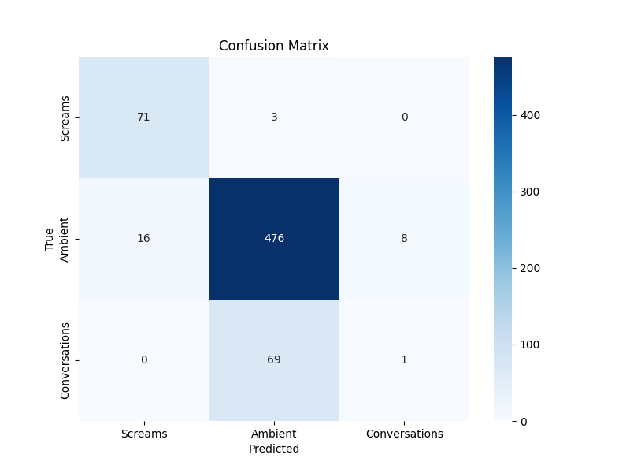
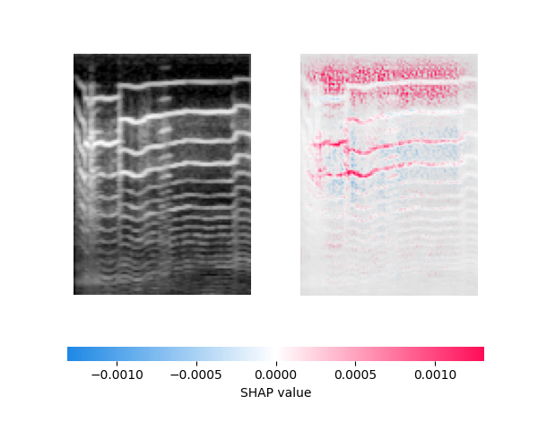
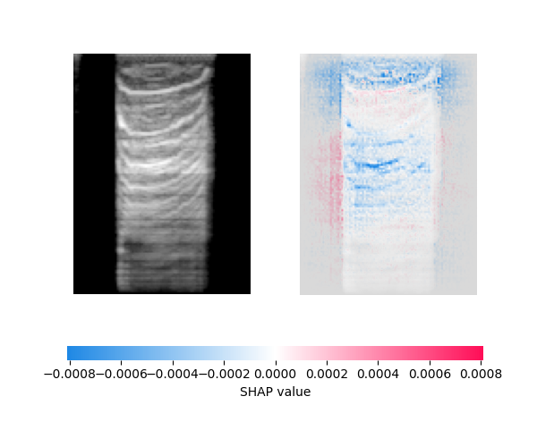
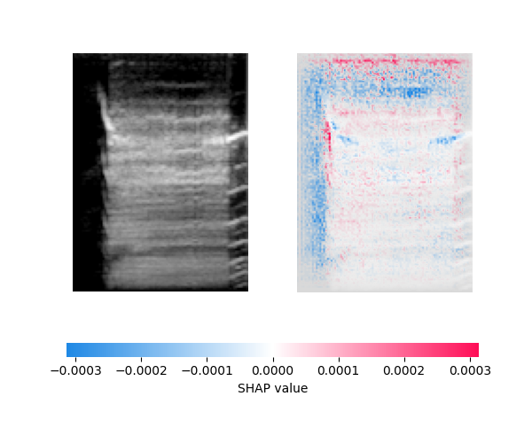

# Scream Detection

This project implements a deep learning model to detect screams in audio, distinguishing them from ambient sounds and conversations using TensorFlow. The model achieves ~85% accuracy on a multi-class classification task (Screams, Ambient, Conversations) and includes interpretability analysis with SHAP.
---
## 📁 Project Structure
```bash
scream-detector-project/
├── data/                          # Audio data organized by class
│   ├── ambient/                   # Raw ambient audio (from UrbanSound8K)
│   ├── ambient_converted/        # Processed ambient audio (16 kHz, mono)
│   ├── screams/                  # Scream audio samples (74 WAV files)
│   ├── conversations/            # Conversation audio (~70 WAV files)
│
├── images/                        # Visualizations and interpretation outputs
│   ├── confusion_matrix.png
│   ├── shap_class_0.png          # SHAP plot - Ambient class
│   ├── shap_class_1.png          # SHAP plot - Screams class
│   ├── shap_class_2.png          # SHAP plot - Conversations class
│
├── models/                        # Saved trained models
│   └── scream_model.h5           # Trained model file
│
├── src/                           # Source code and utility scripts
│   ├── train.py                  # Model training script
│   ├── evaluate.py               # Evaluation script
│   ├── interpret.py              # SHAP model interpretation
│   ├── preprocess.py             # Data preprocessing utilities
│   ├── convert_audio.py          # Audio conversion script
│   ├── filter_urbansound8k.py    # Filter and select audio from UrbanSound8K
│   ├── model.py                  # CNN model architecture
│   └── UrbanSound8K/
│       ├── FREESOUNDCREDITS.txt  # UrbanSound8K license and credits
│       └── metadata/
│           └── UrbanSound8K.csv  # Dataset metadata
│
├── venv/                          # Virtual environment (excluded from version control)
│
├── README.md                      # Project documentation
└── requirements.txt               # Python dependencies
```
---

## 🎧 Dataset

- **Total**: 644 WAV files (mono, 16 kHz)
- **Classes**:
  - Screams: 74 samples
  - Ambient: ~500 samples (many from UrbanSound8K)
  - Conversations: 70 samples
- **Features**: MFCCs with shape `(128, 94)` reshaped to `(128, 94, 1)` for CNN input

> 📦 **Source**: Ambient audio partially derived from the [UrbanSound8K dataset](https://urbansounddataset.weebly.com/urbansound8k.html). After downloading, place relevant files under `data/ambient/`. See `src/UrbanSound8K/FREESOUNDCREDITS.txt` for attributions.

---

## 📊 Model Performance

- **Training Accuracy**: ~80.41% (with early stopping at 6 epochs)
- **Test Accuracy**: 85%
- **F1-Scores**:
  - Screams: 0.88
  - Ambient: 0.91
  - Conversations: 0.03 ⚠️ *(due to class imbalance)*

### Confusion Matrix


### SHAP Interpretability
- **Ambient**:
  
- **Screams**:
  
- **Conversations**:
  

---

## 🧰 Requirements

- Python 3.8+
- Dependencies (see `requirements.txt`):
  - `tensorflow`
  - `librosa`
  - `numpy`
  - `scikit-learn`
  - `matplotlib`
  - `shap`
  - `lime`
  - `pydub`
  - `ipython` *(optional, for SHAP visualizations)*

---

## ⚙️ Setup

1. **Clone the Repository**
   ```bash
   git clone https://github.com/devi-harikaa/scream-detector-project.git
   cd scream-detector-project
Create Virtual Environment

```bash
Copy
Edit
python -m venv venv
source venv/bin/activate       # For Linux/Mac
.\venv\Scripts\activate        # For Windows
```
Install Dependencies

```bash
Copy
Edit
pip install -r requirements.txt
```
Prepare Dataset

Download UrbanSound8K

Organize files into:
```
data/screams/

data/ambient_converted/

data/conversations/

Ensure all WAV files are 16 kHz, mono.

Use src/convert_audio.py and src/filter_urbansound8k.py as needed.
```
🧪 Usage
Train the Model
```bash
Copy
Edit
python src/train.py
Model saved to models/scream_model.h5
```
Evaluate the Model
```bash
Copy
Edit
python src/evaluate.py
Outputs evaluation metrics and saves images/confusion_matrix.png
```


⚠️ Notes
Class Imbalance: Low F1 for Conversations is due to fewer training samples. Consider oversampling or using class weights in train.py.

SHAP Compatibility: Uses GradientExplainer to support TensorFlow models with batch normalization layers.

CPU/GPU: Runs on CPU by default. For GPU support, install CUDA 11.0, cuDNN 8.0, and tensorflow-gpu.

🔮 Future Improvements
Augment dataset with more Screams and Conversations

Improve generalization with dropout/regularization

Use class weights for better balance during training

Extend project to support real-time scream detection from live microphone input

📝 License
MIT License

📬 Contact
For queries or suggestions, contact Neeharika at: harikadevi414@gmail.com
